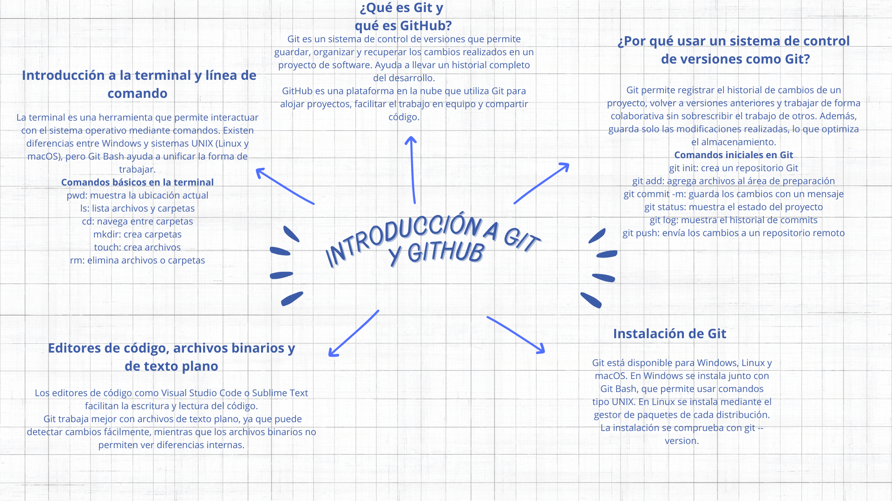
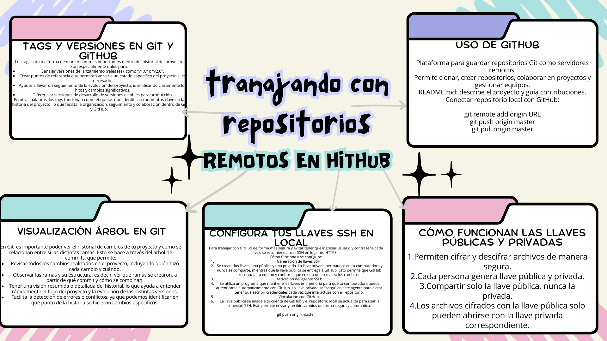

# 📘 Introducción a Git y GitHub

## 📑 Tabla de Contenido

- [📘 Introducción](#-introducción-a-git-y-github)
- [🗂 Mapas Mentales](#-mapas-mentales)
- [📌 Contenido del Proyecto](#-contenido-del-proyecto)
- [🚀 Comandos Esenciales](#-comandos-esenciales)
- [🎯 Objetivo](#-objetivo)
-
Este repositorio contiene una guía introductoria sobre Git, GitHub y el flujo de trabajo con repositorios locales y remotos.
Incluye mapas mentales que resumen los conceptos fundamentales y comandos principales.

## 🗂 Mapas Mentales

### 🧠 1️⃣ Introducción a Git y GitHub


### 💻 2️⃣ Comandos básicos en Git


### 🔄 3️⃣ Flujo de trabajo básico en Git


### 🌐 4️⃣ Trabajo con repositorios remotos en GitHub


---

## 📌 Contenido del Proyecto

Este material incluye:

- Introducción a la terminal  
- Instalación de Git  
- Configuración de usuario  
- Ciclo de vida de los archivos  
- Uso de ramas (branches)  
- Git merge y solución de conflictos  
- Trabajo con repositorios remotos  
- Configuración de llaves SSH  
- Tags y versiones  

---

## 🚀 Comandos esenciales

```bash
git init
git add .
git commit -m "mensaje"
git branch nombre_rama
git checkout -b nueva_rama
git merge rama
git push origin master
git pull origin master
---

Actualizado el 16/02/2026